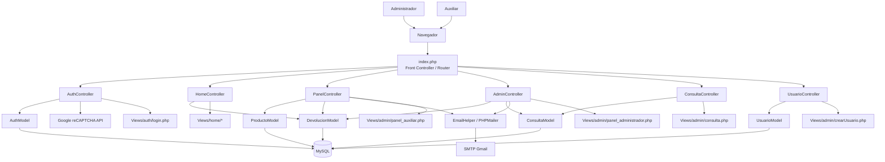

# Arquitectura de software — DevolutionSync (Proyecto_UCP)

## 1) Visión general
DevolutionSync es una aplicación web monolítica en **PHP 8.2 + Apache** con patrón **MVC básico** y enrutamiento frontal por `index.php`. El sistema gestiona el ciclo de vida de devoluciones: registro (auxiliar), revisión (administrador), consulta histórica y tablero de indicadores.

- **Entrada única (Front Controller):** `index.php`.
- **Control de acceso por sesión y rol:** `$_SESSION['grado']`.
- **Persistencia:** MySQL vía PDO (`Config/Conexion.php`).
- **Integraciones externas:** Google reCAPTCHA (login) y SMTP (notificaciones por correo).

---

## 2) Estilo arquitectónico
El repositorio implementa una arquitectura por capas dentro de un monolito:

1. **Presentación (Views + assets):** formularios, dashboard, panel de revisión.
2. **Aplicación (Controllers):** orquestación de casos de uso y validaciones de flujo.
3. **Dominio/Persistencia (Models):** consultas SQL y reglas de datos.
4. **Infraestructura (Config):** conexión DB y helper de correo.

### Front Controller y enrutamiento
`index.php` descompone `?url=controlador/metodo`, carga dinámicamente el controlador y ejecuta el método solicitado. Si no hay URL, redirige por rol (admin/auxiliar/login).

---

## 3) Módulos funcionales principales

### 3.1 Autenticación
- **Controlador:** `AuthController`.
- **Modelo:** `AuthModel`.
- **Flujo:** login con validación de reCAPTCHA servidor-a-servidor → consulta usuario → creación de sesión y redirección por rol.

### 3.2 Registro de devoluciones (auxiliar/admin)
- **Controlador:** `PanelController`.
- **Modelos:** `ProductoModel`, `DevolucionModel`.
- **Infra:** `EmailHelper`.
- **Flujo:** selección producto + validación de campos + carga de evidencia + inserción en `devoluciones` + notificación al admin.

### 3.3 Revisión administrativa
- **Controlador:** `AdminController`.
- **Modelos:** `DevolucionModel`, `ConsultaModel`.
- **Infra:** `EmailHelper`.
- **Flujo:** consulta pendientes → aprobar/rechazar con código y observación → actualización transaccional → notificación al solicitante.

### 3.4 Dashboard y consulta histórica
- **Dashboard:** `HomeController` usa `DevolucionModel::obtenerEstadisticas()`.
- **Historial/detalle:** `ConsultaController` usa `ConsultaModel` y renderiza detalle en HTML para modal/consulta.

### 3.5 Administración de usuarios
- **Controlador:** `UsuarioController`.
- **Modelo:** `UsuarioModel`.
- **Flujo:** creación/listado de usuarios por rol administrador.

---

## 4) Modelo de datos (tablas relevantes)
Desde `database/devolutionsync.sql`:

- **`devoluciones`**: núcleo transaccional del sistema (estado, motivos, cantidades, evidencia, revisión).
- **`usuarios`**: autenticación/autorización básica por `GRADO`.
- **`producto`**: catálogo para selección en registro.
- **`login_attempts`** y **`notificaciones`**: presentes en esquema, con uso parcial en el código actual.

---

## 5) Seguridad y consideraciones técnicas

1. **Autorización por sesión:** múltiples controladores validan `logged_in` y rol.
2. **reCAPTCHA server-side en login:** mitiga automatización de intentos.
3. **Consultas preparadas PDO:** reduce riesgo de SQL injection.
4. **Carga de archivos restringida por extensión/tamaño:** evidencias hasta 5 MB.
5. **Riesgos detectados en el estado actual:**
   - Credenciales sensibles en código (`Conexion.php`, `EmailHelper.php`).
   - Contraseñas de usuarios en texto plano (`usuarios.PAS`).
   - Inconsistencias de mayúsculas/minúsculas en estados (`Pendiente` vs enum SQL `pendiente`).

---

## 6) Despliegue

La app se ejecuta en contenedor Docker con imagen `php:8.2-apache`, extensiones `pdo`, `pdo_mysql`, `mysqli` y mapeo de puerto `8097:80`. El `docker-compose` actual define solo el servicio web (la BD se consume externamente según `Conexion.php`).

---

## 7) Diagrama de arquitectura (Mermaid)
> También disponible como archivo independiente en `documentacion/diagrama-arquitectura.mmd`.

---

## 8) Flujo end-to-end resumido
1. Usuario inicia sesión (reCAPTCHA + credenciales).
2. Auxiliar registra devolución con evidencia.
3. Sistema guarda en DB y avisa al administrador por correo.
4. Administrador revisa y cambia estado (aprobado/rechazado).
5. Sistema notifica por correo al solicitante.
6. Dashboard e historial reflejan métricas y trazabilidad.

